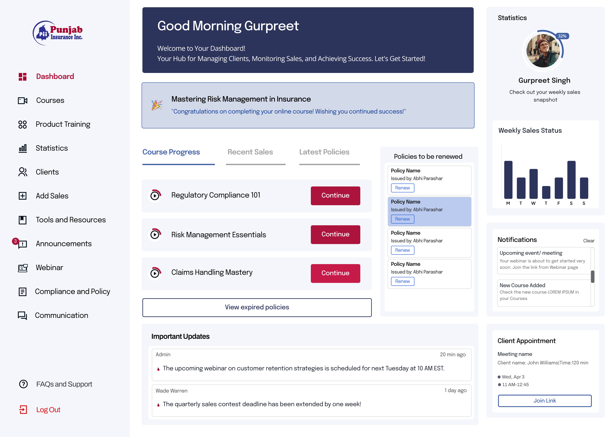
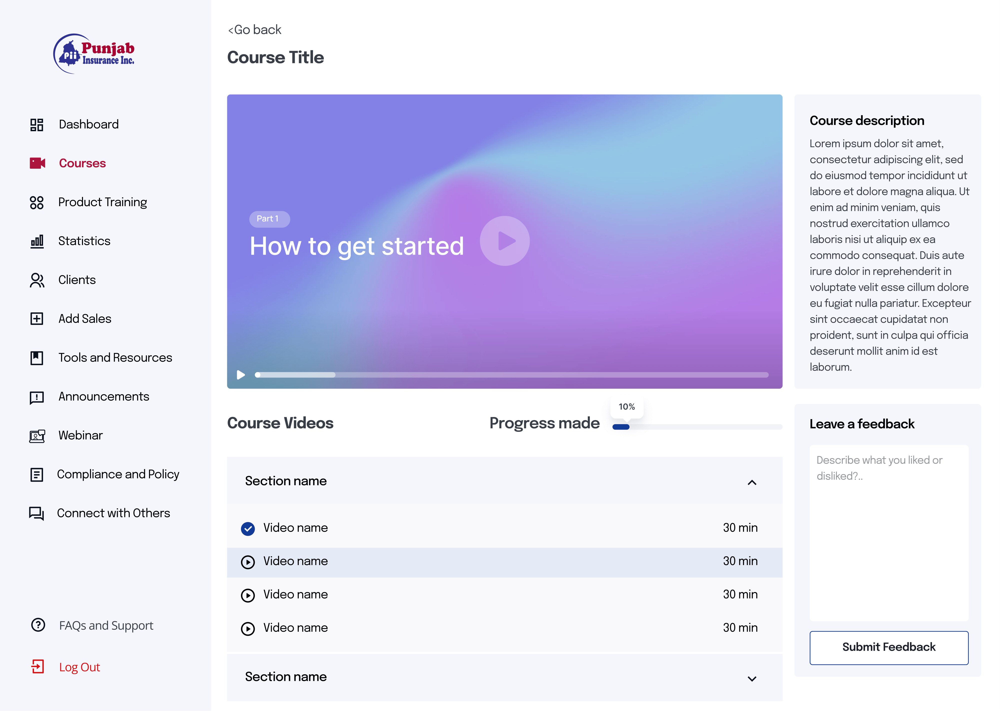
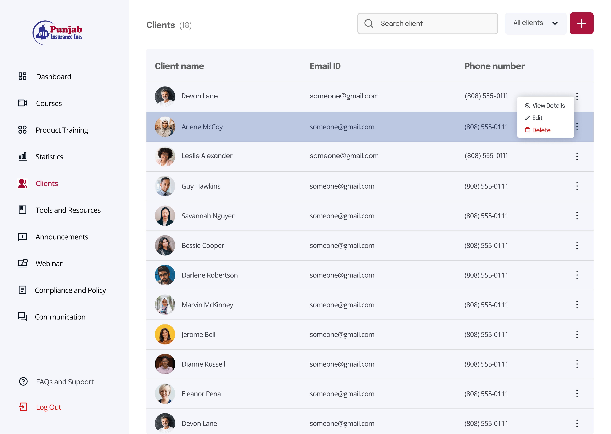
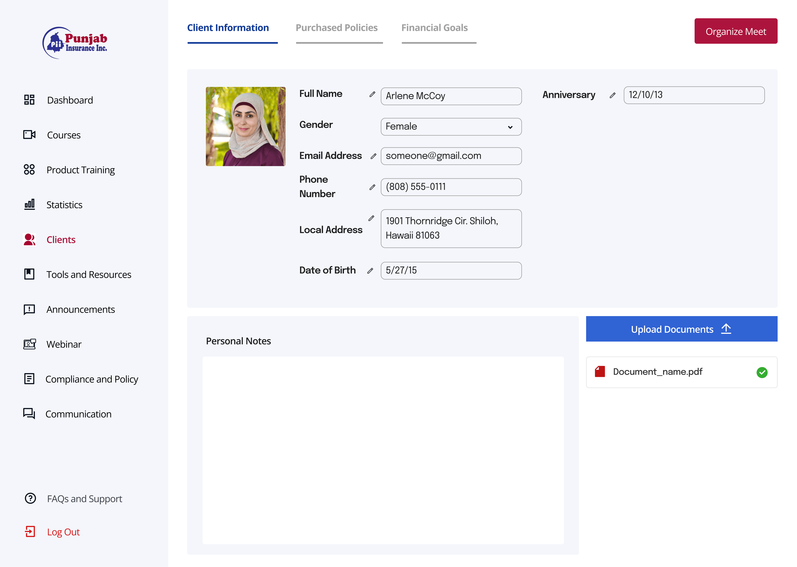
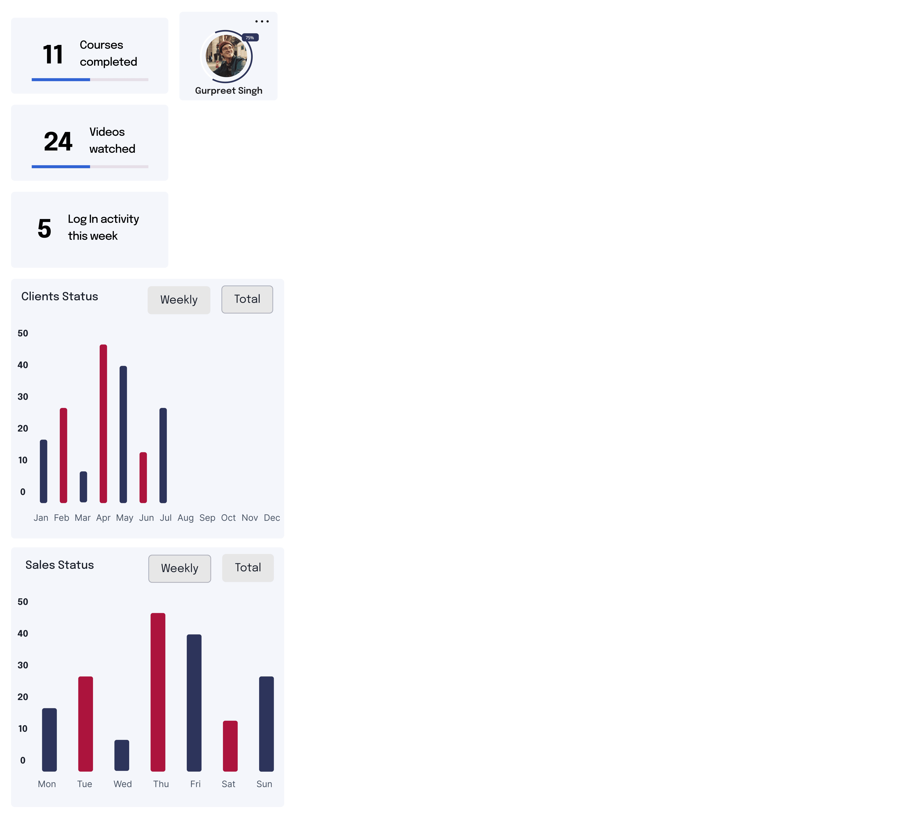
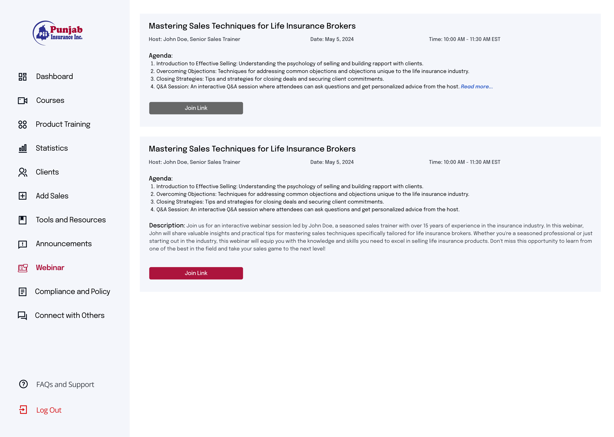
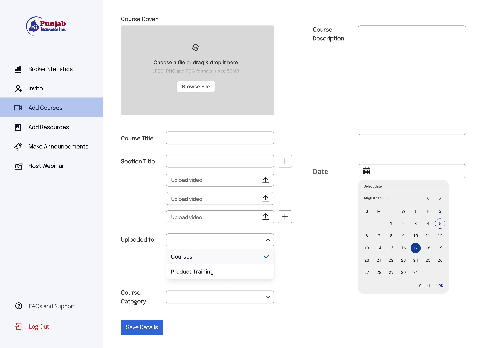
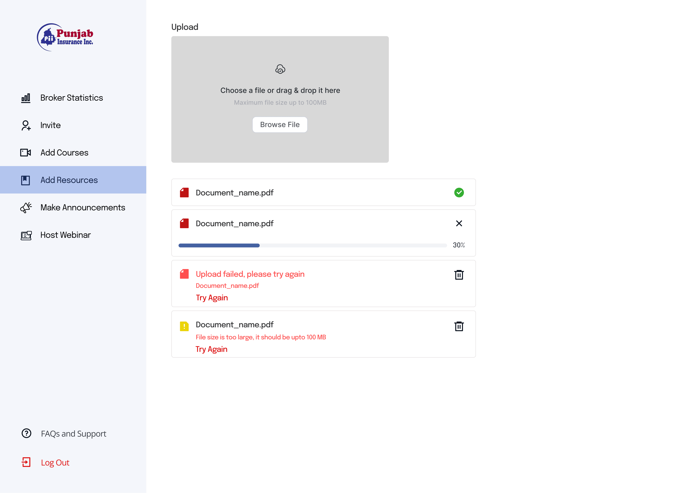
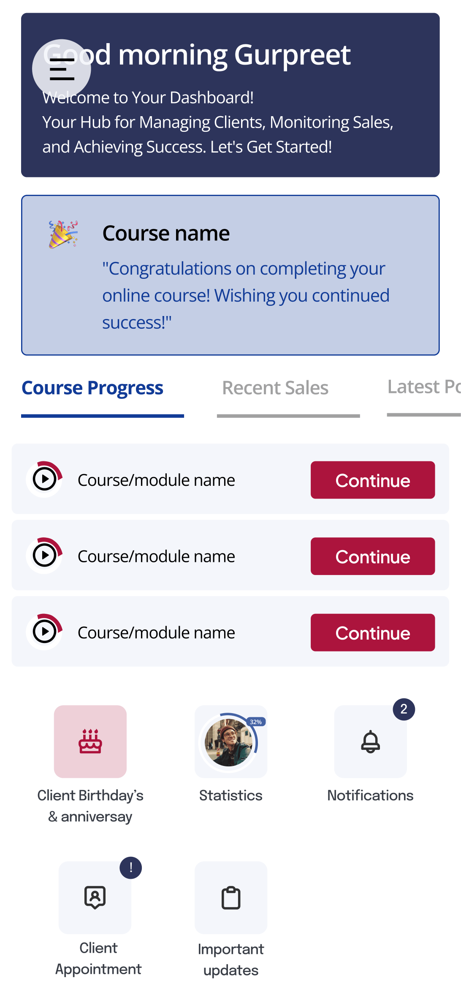

# Training Portal — Punjab Insurance Canada

A full-stack broker training and client management platform built for Punjab Insurance Inc. — enabling insurance brokers to complete compliance training, manage their client book, track sales, and attend live webinars from a single dashboard.

**Built as a paid client engagement. Frontend deployed on Vercel. Backend API deployed on AWS.**

---

## Screenshots

### Broker Dashboard

*Personalized broker dashboard — course progress, policies to renew, weekly sales snapshot, notifications, and upcoming client appointments in one view*

### Course Player

*Video-based course player with section navigation, per-video progress tracking, and an inline feedback submission form*

### Client Management

*Full client CRM — searchable client list with inline View / Edit / Delete actions*


*Client detail page — tabbed view across Client Information, Purchased Policies, and Financial Goals. Includes personal notes, document upload, and one-click meeting scheduling*

### Statistics

*Per-broker analytics — courses completed, videos watched, weekly login activity, monthly client acquisition chart, and weekly sales performance chart*

### Webinar

*Live webinar listings with host, agenda, description, and direct join link*

### Admin Panel — Add Courses

*Admin course creation — cover image upload, section builder, per-section video uploads, category and date selection*

### Admin Panel — Add Resources

*Resource upload panel with drag-and-drop, real-time upload progress, and error state handling (file too large, upload failed)*

### Mobile View

*Fully responsive — built for brokers working on mobile in the field*

---

## What It Solves

Punjab Insurance Canada needed a centralized platform for their broker network. Before this system, brokers had no structured way to complete product training, no single place to manage their client book, and no visibility into their own sales and engagement metrics.

This platform gives brokers a single dashboard to:
- Complete video-based compliance and product training at their own pace
- Manage their full client list with policy and financial goal tracking
- Monitor their own performance through real-time statistics
- Attend live webinars hosted by senior trainers
- Access compliance documents and company announcements

Admins get a separate panel to create courses, upload resources, invite brokers, and host webinars — without touching any code.

---

## Tech Stack

| Layer | Technology |
|---|---|
| Frontend | Next.js (React) |
| Backend API | Django REST Framework (Python) |
| Hosting — Frontend | Vercel |
| Hosting — Backend | AWS EC2 (Virtual Machine) |
| Authentication | JWT via DRF |
| Testing | DRF test suite — full API test coverage |

---

## Key Features

### Broker Portal
- **Personalized dashboard** — greeting, active course progress, policies requiring renewal, weekly sales chart, notification feed, upcoming client appointments
- **Video course system** — courses organized into sections, per-video completion tracking, progress bar, inline feedback submission
- **Client CRM** — full client list with search and filter, client detail pages with tabs for personal info, purchased policies, financial goals, personal notes, document uploads, and meeting scheduling via *Organize Meet*
- **Statistics** — personal performance analytics: courses completed, videos watched, weekly login activity, monthly client status chart, weekly sales status chart, searchable broker lookup
- **Webinar** — live webinar listings with agenda, host info, date/time, and join link
- **Tools & Resources** — downloadable compliance and product documents
- **Announcements** — real-time admin broadcasts surfaced on the dashboard
- **Compliance & Policy** and **Communication** modules

### Admin Panel
- **Course builder** — create courses with a cover image, multiple sections, per-section video uploads, category tagging, and scheduled release dates
- **Resource manager** — drag-and-drop file upload with real-time progress tracking and clear error states (file too large, upload failed, retry)
- **Broker management** — invite new brokers, view broker-level statistics
- **Announcements** — broadcast updates to all brokers
- **Webinar hosting** — create and manage webinar listings

### API Design (Django REST Framework)
- RESTful API architecture following DRF best practices
- JWT-based authentication with role separation (broker vs. admin)
- Full test suite covering all API endpoints
- Deployed on AWS EC2 — separate from the frontend for clean separation of concerns

---

## Architecture Overview

```
┌─────────────────────────┐         ┌──────────────────────────────┐
│   Next.js Frontend      │  HTTP   │  Django REST Framework API   │
│   (Vercel)              │◄───────►│  (AWS EC2)                   │
│                         │   JWT   │                              │
│  - Broker Portal        │         │  - Auth endpoints            │
│  - Admin Panel          │         │  - Course management         │
│  - Responsive (mobile)  │         │  - Client CRUD               │
└─────────────────────────┘         │  - Statistics aggregation    │
                                    │  - Resource management        │
                                    │  - Full test suite           │
                                    └──────────────────────────────┘
```

---

## Project Context

This was a paid client project built for Punjab Insurance Inc. (Canada). I was the lead developer responsible for the full system — from API design through frontend implementation, testing, and deployment.

The client provided design mockups. I translated those into a working full-stack system with a clean DRF REST API, a Next.js frontend consuming it, and a complete test suite covering the backend.

---

## Role & Responsibilities

- Designed and implemented the full Django REST Framework API from scratch
- Built the Next.js frontend consuming the API — all pages across broker and admin flows
- Set up JWT authentication with role-based access control (broker vs. admin)
- Wrote comprehensive API test cases following DRF testing methodology
- Deployed frontend to Vercel and backend API to AWS EC2
- Owned the project end-to-end as sole developer

---

## Related Projects

- **[PowerCompass Pro](https://github.com/AbhayParasharhere/powercompass-case-study)** — Multi-tenant SaaS CRM built at Charvar Networks (Next.js + Supabase), 300+ users, 95% satisfaction
- **[Poster Maker](https://github.com/AbhayParasharhere/Poster-maker-frontend)** — Interactive poster creation tool, same client stack (Next.js + DRF)
